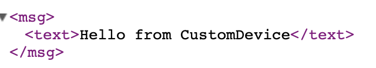

# UPnPLib #
The most common way to find ESP devices on a local network is to use mDNS and give each device a hard coded host name. This means that device developers have to name their devices in a way that avoids conflict, and users have to keep track of all device names on their local network. Simple Service Discovery Protocol (SSDP) is part of the Universal Plug and Play (UPnP) standard, and provides a means to find devices on a local network automatically without mDNS. One device can be named and all others can be discovered. UPnP also provides a protocol for Device Description and a General Event Notification Architecture (GENA).
 
This UPnP library implements an abbreviated version of [UPnP SSDP](http://upnp.org/specs/arch/UPnP-arch-DeviceArchitecture-v1.1.pdf) that gives just enough information to populate a UPnP device hierarchy (root, embedded devices, and services) and allow query for device type and availability. It also provides base class implementation for UPnPDevice, UPnPService, and RootDevice, and a framework for HTML user interface for device interaction. The library <b>does not provide Device Description or Eventing</b>. Device control is provided via HTML interface and UPnPService handlers. The code is intended for Arduino devices ESP8266 and ESP32, and requires the additional [CommonUtil library](https://github.com/dltoth/CommonUtil/) to facilitate device user interface and Web Server abstraction. The companion library [DeviceLib](https://github.com/dltoth/DeviceLib) provides a rich set of turnkey UPnPDevices for ESP8266/ESP32, but is not required. 

In what follows, the basic structure for creating custom UPnPDevices and UPnPServices, and advertising them over a local network with SSDP is presented.

## Basic Usage ##
UPnP Defines three basic constructs: root devices, embedded devices, and services, where both root devices and embedded devices can have services and embedded devices. Services are leaf nodes of the hierarchy and may not have either embedded devices or services. Essentially, a root device is a container for a device heirarchy consisting of embedded devices and services. UPnP does not limit the depth or breadth of a device heirarchy. Root devices publish their functionality over HTTP and discovery (SSDP) over UDP.

**Important Note:** In this library, only root devices (<i>RootDevice</i>) can have embedded devices (<i>UPnPDevice</i>), and the number of embedded devices is limited to 8. Both root devices and embedded devices can have services (<i>UPnPService</i>), and the number of services is also limited to 8.

In terms of class heirarchy, <i>RootDevice</i> is a subclass of <i>UPnPDevice</i>, which in turn is a subclass of <i>UPnPObject</i>, and <i>UPnPService</i> is a subclass of <i>UPnPObject</i>. The classes <i>RootDevice</i>, <i>UPnPDevice</i>, <i>UPnPService</i> and <i>SSDP</i> are expected to be constructed and managed in global scope above the setup() function in an Arduino sketch. Copy construction and and Object assignment are not allowed; objects are expected to live over the life of an executing application, where UPnPObjects are passed via pointer. The RootDevice is accessible over HTTP at the location <i>http\://device-IP:port</i>, so there must only be a single RootDevice per ESP device. RootDevice is a container for embedded UPnPDevices, which in turn provide functionality. 

A basic sketch has the following form:

```
#define AP_SSID "My_SSID"
#define AP_PSK  "MY_PSK"

#include <UPnPLib.h>
SSDP       ssdp;
RootDevice root;
WebContext ctx;

void setup() {

  Serial.begin(115200);
  while (!Serial) {
    ; // wait for serial port to connect
  }

  Serial.println();
  Serial.printf("Starting Test Device\n");

// Start WiFi
  WiFi.begin(AP_SSID,AP_PSK);
  Serial.printf("Connecting to Access Point %s\n",AP_SSID);
  while(WiFi.status() != WL_CONNECTED) {Serial.print(".");delay(500);}
  Serial.printf("\nWiFi Connected to %s with IP address: %s\n",WiFi.SSID().c_str(),WiFi.localIP().toString().c_str());
  
// Start SSDP
  ssdp.begin(&root);
  
// Start a Web Server
  ctx.begin();
 
// Setup the RootDevice display name and target URL
  root.setDisplayName("Test Device");   
  root.setTarget("root");  
  root.setup(&ctx);
 
}

void loop() {
  ctx.handleClient();     // Handle HTTP requests with the Web Server
  ssdp.doSSDP();          // Handle SSDP Queries
  root.doDevice();        // Perform a unit of work for the device
}
```

In the example above, notice the declaration ``WebContext ctx;``. <i>WebContext</i> is a Web Server abstraction unifying ESP8266 and ESP32 Web Servers, providing a common API for both. Both APIs are nearly, but not identical, so check out the [header description](https://github.com/dltoth/CommonUtil/blob/main/src/WebContext.h) for usage. Also notice the call to ``root.setup(&ctx);``. This is where the RootDevice is initialized, and in particular, when HTTP handlers are registered with the Web Server. So, <i>RootDevice</i> setup MUST happen after WebContext initialization.

**Important Note:** `WebContext.begin()` MUST be called before `RootDevice.setup()`


With the above sketch, <b><i>root</i></b> will have it's user interface advertised via SSDP at the location `http://device-IP:80`. The base <i>RootDevice</i> class provides a specific HTML user interaction model, which is described in more detail in [Custom Device](#custom-upnpdevice-definition) section below. Customization of the UI is typically done by subclassing <i>UPnPDevice</i> and adding custom devices to the root, but a simple UI can be implemented by providing a <i>displayHandler</i> to <i>RootDevice</i>. For example, add the following lines of code below the <i>#include "UPnPLib"</i> declaration:

```
const char html_template[]   PROGMEM = "<!DOCTYPE html><html><meta name=\"viewport\" content=\"width=device-width, initial-scale=1.0\">"
                                       "<head><link rel=\"stylesheet\" type=\"text/css\" href=\"/styles.css\"></head>"
                                       "<body style=\"font-family: Arial\">"
                                         "<H3 align=\"center\"> %s </H3><br><br>"
                                         "<div align=\"center\">"
                                            "<br><br><p align=\"center\">Hello from Root Device</p><br>"
                                         "</div>"
                                       "</body></html>";

```
And add the following lines of code just after <i>root.setup(&ctx)</i>:

```
  DisplayHandler rootDisplay = [](UPnPDevice* d,WebContext* svr){
   char buffer[DISPLAY_SIZE];
   int size = sizeof(buffer);
   int pos = 0;
   char path[100];
   RootDevice* rootPtr = d->asRootDevice();
   if( rootPtr != NULL ) {
     pos = formatBuffer_P(buffer,size,pos,html_template,rootPtr->getDisplayName());   
     svr->send(200,"text/html",buffer);
   }
  };
  root.setDisplayHandler(rootDisplay);
  root.setRootDisplayHandler(rootDisplay);

```

Starting the device will now display the welcome message "Hello from Root Device" at <i>http\://device-IP:80</i>. Note that since we set the RootDevice <i>target</i> to <i>root</i>, and set the same displayHandler on root display, the same welcome message will appear at <i>http\://device-IP:80/root</i>.

<a name="basic-search"></a>

## Basic Search ##

Lastly, as an example demonstrating device discovery, flash one ESP device with the above code and start it up on a local network. Then flash a second device with the following code:

```
#define AP_SSID "My_SSID"
#define AP_PSK  "MY_PSK"

#include <UPnPLib.h>
SSDP       ssdp;
void setup() {
  Serial.begin(115200);
  while (!Serial) {
    ; // wait for serial port to connect
  }

  Serial.println();
  Serial.printf("Starting SSDP Query\n");
  
  WiFi.begin(AP_SSID,AP_PSK);
  Serial.printf("Connecting to Access Point %s\n",AP_SSID);
  while(WiFi.status() != WL_CONNECTED) {Serial.print(".");delay(500);}
  Serial.printf("\nWiFi Connected to %s with IP address: %s\n",WiFi.SSID().c_str(),WiFi.localIP().toString().c_str());
  
// Perform an SSDP search for RootDevices and print display name and location
  char  nameBuff[64];
  char* name = nameBuff;
  char  locBuff[64];
  char* loc = locBuff;
  char  usnBuff[128];
  char* usn = usnBuff;
  char  descBuff[128];
  char* desc = descBuff;

  Serial.printf("Starting RootDevice search...\n");
  SSDP::searchRequest("upnp:rootdevice",([name,loc,usn,desc](UPnPBuffer* b){
      name[0] = '\0';
      loc[0]  = '\0';
      usn[0]  = '\0';
      desc[0] = '\0';
      if( b->displayName(name,64) ) {
          b->headerValue("LOCATION",loc,64);
          b->headerValue("USN",usn,128);
          b->headerValue("DESC.LEELANAUSOFTWARE.COM",desc,128);
          Serial.printf("   Root Device: %s \n      USN: %s \n      LOCATION: %s\n      DESC: %s\n",name,usn,loc,desc);
      }  
  }),WiFi.localIP(),10000);
  Serial.printf("...RootDevice search complete\n");  
  Serial.printf("SSDP Query complete\n");  
}

void loop() {
}
```

When the second device is started on the same local network with a Serial terminal, the following output is produced:

```
Starting SSDP Query Test for Board ESP8266
Connecting to Access Point My_SSID
...........
WiFi Connected to My_SSID with IP address: 10.0.0.165
Starting RootDevice search...
Root Device: Test Device 
      USN: uuid:b2234c12-417f-4e3c-b5d6-4d418143e85d::urn:LeelanauSoftwareCo-com:device:RootDevice:1 
      LOCATION: http://10.0.0.165:80/
      DESC: :name:Test Device:devices:0:services:0:
...RootDevice search complete
SSDP Query complete
```

Notice that a RootDevice with display name <b><i>Test Device</i></b> is found. Its UUID is <b><i>b2234c12-417f-4e3c-b5d6-4d418143e85d</i></b> and uniform resource name (URN) is <b><i>LeelanauSoftwareCo-com:device:RootDevice:1</b></i>. The location of its user interface is `http://10.0.0.165:80`

Additional detail on the SSDP implementation can be found in [SSDP Detail](#ssdp-detail) below.

<a name="custom-upnpdevice-definition"></a>

## Custom UPnPDevice Definition ##

The <i>UPnPDevice</i> and <i>UPnPService</i> classes are intended to be subclassed to provide Runtime Type Identification (RTTI) and unique supply UPnP device identifiers for SSDP search. In addition, subclassed <i>UPnPDevice</i> will supply HTML for the user interface and subclassed <i>UPnPService</i> will provide externalization for device control. Consider the [CustomDevice](https://github.com/dltoth/UPnPLib/blob/main/examples/CustomDevice) example below consisting of <i>CustomService</i> and <i>CustomDevice</i> classes. Starting with [CustomService](https://github.com/dltoth/UPnPLib/blob/main/examples/CustomDevice/CustomService.h):

```
#ifndef CUSTOMSERVICE_H
#define CUSTOMSERVICE_H
#include <UPnPLib.h>

class CustomService : public UPnPService {
  public:
    CustomService() : UPnPService("getMsg") {setDisplayName("Custom Service");};
    CustomService(const char* target) : UPnPService(target) {setDisplayName("Custom Service");};
    virtual ~CustomService() {}

    DEFINE_RTTI;
    DERIVED_TYPE_CHECK(UPnPService);

/**
 *   Copy construction and destruction are not allowed
 */
     DEFINE_EXCLUSIONS(CustomService);         
};

#endif
```

Constructors for <i>CustomService</i> set the URL target and display name. The macro ``DEFINE_RTTI``, defined in [UPnPService.h](https://github.com/dltoth/UPnPLib/blob/main/src/UPnPService.h), is used to define Runtime Type Identification (RTTI) and UPnP device type (or service type), and defines the following public methods:

```
     public:  static const ClassType* classType();               // Static class type
     public:  virtual void*           as(const ClassType* t);    // Type safe class cast operator
     public:  static const char*      upnpType();                // Return UPnP type for object class
     public:  virtual const char*     getType();                 // Return UPnP type for object instance
     public:  virtual boolean         isType(const char* t);     // Return true if UPnPObject instance type is t (strcmp(t,getType()) == 0)
```

and the macro ``DERIVED_TYPE_CHECK(UPnPService)`` adds the virtual type check function:

```
     public: virtual boolean isClassType( const ClassType* t);   // Virtual type check
```

RTTI is described in more detail in the section [Why RTTI](#why-rtti) below.

In order to enforce the memory model for UPnPLib, the macro ``DEFINE_EXCLUSIONS(CustomDevice);`` adds the following lines of code to a header file:

```
      CustomDevice(const CustomDevice&)= delete;
      CustomDevice& operator=(const CustomDevice&)= delete;
```
which disallows copy construction and assignment operator. 

Implementation for [CustomService](https://github.com/dltoth/UPnPLib/blob/main/examples/CustomDevice/CustomService.cpp) contains the single line:

```
      INITIALIZE_SERVICE_TYPES(CustomService,LeelanauSoftware-com,CustomService,1.0.0);
```

Which defines static class type and <i>UPnPService</i> type.

As mentioned above, a <i>UPnPDevice</i> can be controlled strictly by HTML user interface, or its control can be externalized with <i>UPnPService</i>, either providing a unit of work, setting  parameters, or retrieving values. Device control is implemented via a ``HandlerFunction`` defined as:

```
      typedef std::function<void(WebContext*)> HandlerFunction;
```

in [WebContext.h](https://github.com/dltoth/CommonUtil/WebContext.h). A <i>HandlerFunction</i> is defined on a <i>UPnPDevice</i> and set on a <i>UPnPService</i>, with an example shown in the implementation of [CustomDevice](https://github.com/dltoth/UPnPLib/blob/main/examples/CustomDevice/CustomDevice.cpp) below. 

Starting with [CustomDevice](https://github.com/dltoth/UPnPLib/blob/main/examples/CustomDevice/CustomDevice.h) definition:

```
/**
 *
 */
 
#ifndef CUSTOMDEVICE_H
#define CUSTOMDEVICE_H
#include <UPnPLib.h>
#include "CustomService.h"
  
class CustomDevice : public UPnPDevice {
  public:
    CustomDevice();
    CustomDevice(const char* target);

    CustomService*  customService() {return &_customService;}

    int formatContent(char buffer[], int size, int pos);       // Format content as displayed at the device target, return updated write position
    int formatRootContent(char buffer[], int size, int pos);   // Format content as displayed at the root device target, return updated write position

    void    handleGetMsg(WebContext* svr);

    DEFINE_RTTI;
    DERIVED_TYPE_CHECK(UPnPDevice);
    DEFINE_EXCLUSIONS(CustomDevice);

    CustomService    _customService;
    
};

#endif 
```

Similar to <i>CustomService</i>, RTTI and exclusions are set. <i>CustomDevice</i> also has a <i>CustomService</i> member variable to allow the <i>HandlerFunction</i> access to <i>CustomDevice</i> pubic methods. The <i>HandlerFunction</i> is declared

```
    void    handleGetMsg(WebContext* svr);
```

User interface for <i>UPnPDevice</i> is controlled by the methods:

```
    int formatContent(char buffer[], int size, int pos); 
    int formatRootContent(char buffer[], int size, int pos); 
```

In particular, <i>RootDevice</i> displays abreviated HTML for each of its embedded devices at the URL <i>http\://device-IP</i>, using <i>formatRootContent()</i> of each device, and full device display at <i>http\://device-IP/rootTarget/deviceTarget</i> using the device's <i>formatContent()</i> method. The difference in interface look and feel is shown in the [figures below](#device-display).

Both methods are expected to fill <i>buffer</i> with HTML starting at the write position <i>pos</i> and return an updated write position. HTML should consist only of device specific content, and should NOT include HTML document start/end tags, body, style, or title tags, as these are supplied by the base and RootDevice classes. 

Implementation for the display functions and service handler are shown in the [CustomDevice](https://github.com/dltoth/UPnPLib/blob/main/examples/CustomDevice/CustomDevice.pp) implementation:

```
#include "CustomDevice.h"

const char html_template[]        PROGMEM = "<br><br><p align=\"center\">Custom Device Display</p><br>";
const char root_html_template[]   PROGMEM = "<br><br><p align=\"center\">Custom Device Root Display</p><br>";
const char Msg_template[]         PROGMEM = "<?xml version=\"1.0\" encoding=\"UTF-8\"?>"
                                               "<msg>"
                                                  "<text>Hello from CustomDevice</text>"
                                               "</msg>";


INITIALIZE_DEVICE_TYPES(CustomDevice,LeelanauSoftware-com,CustomDevice,1);

CustomDevice::CustomDevice() : UPnPDevice("customDevice") {
  addService(customService());
  customService()->setHttpHandler([this](WebContext* svr){this->handleGetMsg(svr);});
  customService()->setTarget("getMsg");
  setDisplayName("Custom Device");
};

CustomDevice::CustomDevice(const char* target) : UPnPDevice(target) {
  addService(customService());
  customService()->setHttpHandler([this](WebContext* svr){this->handleGetMsg(svr);});
  customService()->setTarget("getMsg");
  setDisplayName("Custom Device");
};

int  CustomDevice::formatContent(char buffer[], int size, int pos) {return formatBuffer_P(buffer,size,pos,html_template,getDisplayName());}
int  CustomDevice::formatRootContent(char buffer[], int size, int pos) {return formatBuffer_P(buffer,size,pos,root_html_template,getDisplayName());}
void CustomDevice::handleGetMsg(WebContext* svr) {svr->send_P(200,"text/xml",Msg_template);}
```

As with <i>CustomService</i>, static class and <i>UPnPDevice</i> types are defined with ``INITIALIZE_DEVICE_TYPES(CustomDevice,LeelanauSoftware-com,CustomDevice,1)``. Target URL and display name are set on the constructor, and <i>CustomService</i> is added to the device with the line

```
  addService(customService());
```


The <i>HandlerFunction</i> is set on <i>CustomService</i> with the line

```
  customService()->setHttpHandler([this](WebContext* svr){this->handleGetMsg(svr);});
```

and the <i>HandlerFunction</i> is defined as 

```
  void CustomDevice::handleGetMsg(WebContext* svr) {svr->send_P(200,"text/xml",Msg_template);}
```

which returns an XML message

```
   "<msg>"
        "<text>Hello from CustomDevice</text>"
   "</msg>";
```

on the HTTP response.

A sketch using [CustomDevice](https://github.com/dltoth/UPnPLib/blob/main/examples/CustomDevice/CustomDevice.ino) will then have the form: 

```
#include <UPnPLib.h>
#include "CustomDevice.h"
#include "CustomService.h"

/**
 *   Simple example to make a device visible on a local network using SSDP with a custom HTML UI. 
 *   RootDevice will respond to SSDP queries and provide the location of its HTML UI
 */

#define AP_SSID "MySSID"
#define AP_PSK  "MyPSK"

#define SERVER_PORT 80

/**
 *   Device hierarchy will consist of a RootDevice (root), a single embedded CustomDevice (d), and a CustomService (s)
 */
WebContext       ctx;
RootDevice       root;
CustomDevice     d;
SSDP             ssdp;

void setup() {
  Serial.begin(115200);
  while (!Serial) {
    ; // wait for serial port to connect. Needed for native USB port only
  }

  Serial.flush();
  Serial.println();
  Serial.printf("Starting CustomDevice\n");

  WiFi.begin(AP_SSID,AP_PSK);
  Serial.printf("Connecting to Access Point %s\n",AP_SSID);
  while(WiFi.status() != WL_CONNECTED) {Serial.print(".");delay(500);}

  Serial.printf("WiFi Connected to %s with IP address: %s\n",WiFi.SSID().c_str(),WiFi.localIP().toString().c_str());

  ctx.begin(SERVER_PORT);
  Serial.printf("Web Server started on %s:%d/\n",WiFi.localIP().toString().c_str(),ctx.getLocalPort());

/**
 *  Initialize SSDP services
 */
  ssdp.begin(&root);

/**
 *  Initalize the device hierarchy. Note that the CustomDevice target will default to "customDevice"
 *  from its default constructor, and the CustomService target will default to "getMsg" from its 
 *  default constructor.
 */
  root.setDisplayName("Root Device");
  root.setTarget("root");  
  root.setup(&ctx);
  root.addDevice(&d);

/**
 *  Print UPnPDevice info to Serial
 */
  UPnPDevice::printInfo(&root);  

}

void loop() {
  ctx.handleClient();
  ssdp.doSSDP();
  root.doDevice();
}

```

Note the following:

* Devices are added to the RootDevice with ``root.addDevice(&d);`` or multiple devices with ``root.addDevices(&d1,...,dN);``. The <i>UPnPDevice::setup()</i> function for is called either when the device is added to root, or when RootDevice::setup() is called. Similarly, UPnPServices can be added to the RootDevice or UPnPDevices.
* Embedded devices will be displayed at <i>http\://device-IP</i> in the order they are added to the RootDevice using their ``formatRootContent()`` method.
* Embedded devices will be displayed at <i>http\://device-IP/rootTarget/deviceTarget</i> using their ``formatContent()`` method.
* The line ``UPnPDevice::printInfo(&root);`` at the end of <i>setup()</i> will print UPnPDevice information for the device hierarchy:

```
Starting CustomDevice
Connecting to Access Point MySSID
........WiFi Connected to MySSID with IP address: 192.168.1.20
Web Server started on 192.168.1.20:80/
RootDevice Root Device:
   UUID: b7d7a4db-5c83-4b5c-b89f-7fc56fdeb9b5
   Type: urn:LeelanauSoftware-com:device:RootDevice:1.0.0
   Location is http://192.168.1.20:80/
   Root Device has no Services
Root Device Devices:
Custom Device:
   UUID: 22b6aabb-17a3-45c7-9b2d-6140676bf1a9
   Type: urn:LeelanauSoftware-com:device:CustomDevice:1
   Location is http://192.168.1.20:80/root/customDevice
   Custom Device Services:
      Custom Service:
         Type: urn:LeelanauSoftware-com:service:CustomService:1.0.0
         Location is http://192.168.1.20:80/root/customDevice/getMsg
```

It shows the <i>RootDevice</i> has a single embedded device named "Custom Device", and <i>CustomDevice</i> has a single service called "Custom Service". <i>RootDevice</i> location is `http://192.168.1.5:80/root` and *CustomDevice* location is `http://192.168.1.5:80/root/customDevice`, so <i>RootDevice</i> is actually available at two URLs: `http://192.168.1.5:80` and `http://192.168.1.5:80/root`. Also note that <i>CustomService</i> location is `http://192.168.1.20:80/root/customDevice/getMsg`.

<a name="device-display"></a>

## Device Display ##

As noted above, <i>RootDevice</i> display is different between <i>http\://device-IP:port</i> and <i>http\://device-IP:port</i>/rootTarget, and <i>UPnPDevice</i> display is different between <i>http\://device-IP:port</i> and <i>http\://device-IP:port</i>/rootTarget/deviceTarget</i>. Display at <i>http\://device-IP:port</i> can be thought of as the root portal view, showing all embdded devices.

*Figure 1 - RootDevice display at* `http://192.168.1.5:80`


Selecting the <b><i>This Device</i></b> button will display the second RootDevice location `http://192.168.1.5:80/root`

*Figure 2 - RootDevice display at* `http://192.168.1.5:80/root`


Notice a single button for <i>Custom Device</i>, and selecting it displays the CustomDevice URL `http://192.168.1.5:80/root/customDevice`

*Figure 3 - CustomDevice display at* `http://192.168.1.5:80/root/customDevice`


Lastly, point a browser to *http\://root-IP:80/root/customDevice/getMsg* to see the result of *CustomService* invocation.

*Figure 4 - XML returned from CustomService at* `http://192.168.1.5:80/root/customDevice/geMsg`



A Rich set of turnkey <i>UPnPDevices</i> and <i>UPnPServices</i> are included in the companion [DeviceLib](https://github.com/dltoth/DeviceLib) library, see the documentation for additional UI examples. The library includes a custom RootDevice, [HubDevice](https://github.com/dltoth/DeviceLib/blob/main/src/HubDevice.h), intended to run as a stand-alone Hub for displaying all SSDP enabled devices on a local network. 

<a name="why-rtti"></a>

## Why RTTI? ##

Since each embedded <i>UPnPDevice</i> provides its own bit of functionality, one device may rely on another. For example, an [OutletTimer](https://github.com/dltoth/DeviceLib/blob/main/src/OutletTimer.h) may require a [SoftwareClock](https://github.com/dltoth/DeviceLib/blob/main/src/SoftwareClock.h), or a [HumidityFan](https://github.com/dltoth/DeviceLib/blob/main/src/HumidityFan.h) may require a [Thermometer](https://github.com/dltoth/DeviceLib/blob/main/src/Thermometer.h). A device implementer, being familiar with onboard embedded devices, will know if a device or service is available. 

Any <i>UPnPObject</i> can retrieve a pointer to the <i>RootDevice</i> as:

```
   RootDevice* root = rootDevice();
```

So, if a <i>RootDevice</i> is expected to include a [SoftwareClock](https://github.com/dltoth/DeviceLib/blob/main/src/SoftwareClock.h), then the static <i>RootDevice</i> method

```
SoftwareClock* clock = (SoftwareClock*)RootDevice::getDevice(rootDevice(), SoftwareClock::classType());
```

can be used to retrieve a pointer to a SoftwareClock. If SoftwareClock is an embedded device and setup() has been called on the RootDevice, clock will be non-NULL. 

**Important Note:** *RootDevice* `setup()` instantiates the device hierarchy, so <code>RootDevice::getDevice()</code> will necessarily return NULL until all <i>UPnPDevices</i> and <i>UPnPServices</i> have been added and setup has been called.

Note that ``static classType()`` is tied to an object class and ``virtual isClassType()`` is tied to an object instance. For example, if <i>ObjA</i> derives from <i>UPnPDevice</i> and <i>ObjB</i> derives from <i>ObjA</i>, then:

```
      ObjB           B;
      ObjA           A;
      UPnPDevice*    ptrA = (UPnPDevice*) A.as(UPnPDevice::classType());  // Not NULL
      UPnPDevice*    ptrB = (UPnPDevice*) B.as(UPnPDevice::classType());  // Not NULL;
      ptrA->isClassType(ObjA::classType());       // True
      ptrA->isClassType(ObjB::classType());       // False
      ptrB->isClassType(ObjA::classType());       // True
      ptrB->isClassType(ObjB::classType());       // True
      ObjA*  aPtr = (ObjA*) ptrB->as(ObjA::classType());  // Not NULL
      ObjB*  bPtr = (ObjB*) ptrA->as(ObjB::classType());  // NULL
```

Similarly, ``static upnpType()`` is tied to the class of a <i>UPnPObject</i> and ``virtual getType()`` is tied to the instance.

<a name="ssdp-detail"></a>

## SSDP Detail ##

SSDP is chatty and could easily consume a small device responding to unnecessary requests. The protocol implemented here is not strictly SSDP, but rather an abbreviated version of the protocol with four main goals: 

1. Reduce chattiness of standard UPnP/SSDP by only responding to known search requests 
2. Provide enough information to populate a device hierarchy of the environment
3. Allow query to see if root devices are still available on the network and
4. Find instances of a specific Device (or Service) type on the network

To this end two custom headers are added; a Search Target header, ST.LEELANAUSOFTWARE.COM for SSDP search, and a device description header, DESC.LEELANAUSOFTWARECO.COM for search responses (both described below). 

<b><i>Important Note:</i></b> Search requests without ST.LEELANAUSOFTWARE.COM, and responses without DESC.LEELANAUSOFTWARECO.COM are silently ignored 

This abreviated protocol does not advertise on startup or shutdown, thus avoiding a flurry of unnecessary UPnP activiy. Devices respond ONLY to specific queries, and ignore all other SSDP requests.

<a name="uuid-device-type-and-usn"></a>

#### UUID, Device Type, and USN ####
UPnP mandates each device have a unique UUID that is persistent between boot cycles. In addition, each device must have a <i>Device Type</i> embedded in a Uniform Resource Name (URN). The form for non-standard UPnP devices is: ``urn:domain-name:device:deviceType:ver``, where <i>domain-name</i> is the vendor's domain name using '-' instead of '.', <i>deviceType</i> is the vendor supplied device type, and <i>ver</i> is the device version. For example: <i>urn:LeelanauSoftware-com:device:RelayControl:1</i> is the URN for version 1 of the device type [RelayControl](https://github.com/dltoth/DeviceLib/blob/main/src/RelayControl.h) provided by LeelanauSoftware.com. 

Lastly, UPnP defines a composite identifier, Unique Service Name (USN), as ``uuid:device-UUID::urn:domain-name:device:deviceType:ver``, where <i>device-UUID</i>, <i>domain-name</i>, and <i>deviceType:ver</i> are as defined above. 

#### Leelanau Software Custom Headers ####

In order to succinctly describe device hierarchy, the custom response header DESC.LEELANAUSOFTWARE.COM is added, and as described above, search responses without this header are ignored.

The DESC header includes a custom field descriptor, <i>puuid</i>, which refers to the parent uuid of a given UPnPDevice (or UPnPService). In this implementation of UPnP, RootDevices can have UPnPServices and UPnPDevices, and UPnPDevices can only have UPnPServices. The maximum number of embedded devices (or services) is restricted 8, thus limiting the device hierarchy. The DESC header field can implicitly refer to a either a RootDevice, an embedded UPnPDevice, or a UPnPService. When coupled with the Unique Service Name (USN), a complete device description in context is given. For example, for a UPnPDevice with uuid <i>device-UUID</i> and type <i>deviceType</i>:

```
USN: uuid:device-UUID::urn:domain-name:device:deviceType:ver
DESC.LEELANAUSOFTWARECO.COM::name:displayName:devices:num-devices:services:num-services
```

will describe a RootDevice with <i>num-devices</i> embedded UPnPDevices, <i>num-services</i> UPnPServices, and whose display name is set to <i>displayName</i> and

```
USN: uuid:device-UUID::urn:domain-name:device:deviceType:ver
DESC.LEELANAUSOFTWARECO.COM::name:displayName:services:num-services:puuid:parent-uuid
```

will describe an embedded UPnPDevice with <i>num-services</i> UPnPServices, whose display name is set to <i>displayName</i> and whose RootDevice uuid is <i>parent-uuid</i>. So the combinition of <i>device-UUID</i> and <i>parent-uuid</i> can uniquely describe the device hierarchy.

Another important difference between this variant of SSDP and standard UPnP/SSDP is that the LOCATION header provides a URL of an HTML UI for a UPnPDevice (or RootDevice), or service interface for a UPnPService, rather than device description. For example:

```
LOCATION: http://10.0.0.165:80/rootDeviceTarget/
```

for the HTML UI of a RootDevice whose target is set to *rootDeviceTarget*, or

```
LOCATION: http://10.0.0.165:80/rootDeviceTarget/embeddedDeviceTarget
```

for the HTML UI of an embedded UPnPDevice whose target is set to *embeddedDeviceTarget*.


In the [example search](#basic-search) code above, the static SSDP::searchRequest method has the following form:

```
static SSDPResult searchRequest(const char* ST, SSDPHandler handler, IPAddress ifc, int timeout=2000, 
                                boolean ssdpAll=false);
```

where

```
ST - Search Target MUST be one of the following:
           upnp:rootdevice                          For RootDevice searches
           uuid:Device-UUID                         For example - uuid: b2234c12-417f-4e3c-b5d6-4d418143e85d
           urn:domain-name:device:deviceType:ver    For example - urn:LeelanauSoftware-com:device:SoftwareClock:1
           urn:domain-name:service:serviceType:ver  For example - urn:LeelanauSoftware-com:service:GetDateTime:1
handler - An SSDPHandler function called on each response to the request
ifc     - The network interface to bind the request to (either WiFi.localIP() or WiFi.softAPIP())
timeout - (Optional) Listen for responses for timeout milliseconds and then return to caller. If ST is 
          uuid:Devce-UUID, processing returns after the specific device responds or timeout expires, otherwise 
          processing returns after timeout milliseconds.
ssdpAll - (Optional) Applies only to upnp:rootdevice searches, if true, ALL RootDevices, embedded UPnPDevices, 
          and UPnPServices respond, otherwise only RootDevices respond.
```

To facilitate ST definition, the static method ``UPnPDevice::upnpType()`` can be used. For example, to search for all [Thermometers](https://github.com/dltoth/DeviceLib/blob/main/src/Thermometer.h) on a local network:

```
Thermometer::upnpType()
```

will provide "<i>urn:LeelanauSoftware-com:device:Thermometer:1</i>" for ST.

SSDP response Header names and values will be one of the following:

```
 CACHE-CONTROL:               - For example, max-age = 1800
 LOCATION:                    - Device or Service URL
 ST:                          - Search Target from search request
 USN: Unique Service Name     - uuid:device-UUID::urn:domain-name:device:deviceType:ver for a UPnPDevice or
                                uuid:device-UUID::urn:domain-name:service:serviceType:ver for a service
 DESC.LEELANAUSOFTWARECO.COM: - name:displayName:devices:num-devices:services:num-services for the RootDevice or
                                name:displayName:services:num-services:puuid:parent-uuid for an embedded device or
                                name:displayName:puuid:parent-uuid: for a UPnPService
```

The timeout parameter defaults to 2 seconds, which is most likely not long enough, so the example above uses 10. Also, SSDP uses UDP, which is inherently unreliable. If you don't see all of the devices you expect, either increase the timeout or re-run the query.

For an example of device search see ``ExtendedDevice::nearbyDevices()``  in [ExtendedDevice](https://github.com/dltoth/DeviceLib/blob/main/src/ExtendedDevice.cpp) in the [DeviceLib library](https://github.com/dltoth/DeviceLib/)

